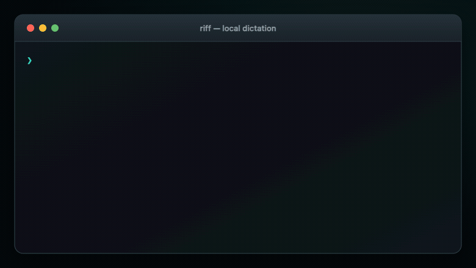

# riff

Local-first dictation CLI for macOS. Riff records a short voice session, collects screenshots and clipboard snippets, transcribes locally with Parakeet, and writes Markdown/HTML notes under your local `RIFF_ROOT`.

Privacy model: session audio, screenshots, clipboard snippets, transcripts, and reports stay on your machine unless you explicitly move or share them. The Parakeet setup may download model/runtime dependencies from their upstream package/model hosts.


## Quickstart

Install riff and provision its private local transcription runtime:

```bash
brew install calebcauthon/riff/riff
riff setup
riff doctor
```

`riff setup` is a one-time step that installs the transcription packages and downloads the Parakeet model. macOS may ask for microphone, screen-recording, or Accessibility access when you first use the related features.

Start talking, optionally capture screenshots, then stop to transcribe:

```bash
riff start
riff shot    # optional: select a region to attach to this session
riff stop
```

Those commands are useful for setup and testing, but riff is designed to disappear behind global hotkeys during everyday use. With Raycast, Alfred, skhd, Hammerspoon, Keyboard Maestro, or a similar launcher, bind keys of your choice to:

```bash
riff --quiet toggle    # start or stop listening
riff --quiet shot      # capture screen context while talking
riff --quiet toggle && riff --quiet send-images  # stop and paste everything
```

For example, the overview above uses `⌥ R` for start/stop, `⌥ S` for screenshots, and `⌥ ↩` to stop and insert the transcript plus screenshots into Claude Code. Choose any keys you like. See [Hotkeys](#hotkeys) for complete examples, including stop-and-paste and opening the HTML report.

Your transcript and local HTML report are now under `/tmp/riff/sessions/<session-id>/`. Print the latest transcript with `riff copy`, paste it into the focused app with `riff send`, or open the report with `riff html`.

For the underlying command-by-command flow:



## How it works

1. `riff start` (or `riff toggle` when idle)
2. Take screenshots with `riff shot` (recommended) or normal `Cmd+Shift+4`
3. `riff stop` (or `riff toggle` when active)

On `stop`, riff:
- stops audio recording
- finds screenshots created during the session in your normal screenshot folder
- copies them to session tmp storage (`/tmp/riff/sessions/<session-id>/screenshots`)
- deletes the originals from your normal screenshot folder
- captures copied clipboard text during the session
- runs local transcription (Parakeet via Python script / warm local server)
- writes `note.md` with `[Screenshot N]` / `[Clipboard N]` markers + footnotes
- writes `note.html` with metadata, transcript, and image preview gallery
- auto-starts local web server (idle-timeout) for richer HTML behavior

---

## Files

```text
/tmp/riff/sessions/<session-id>/
  audio.wav
  events.jsonl
  ffmpeg.log
  transcript.txt        (if transcription succeeded)
  note.md
  note.html
  screenshots/
    shot-001.png
    ...
```

Performance/observability logs:

```text
/tmp/riff/perf.jsonl                # start/stop and Parakeet cold-start timings
/tmp/riff/parakeet-server.log       # warm Parakeet server logs
/tmp/riff/parakeet-server.sock      # Riff-owned local inference socket
/tmp/riff/web-server.log            # local HTML web server logs
/tmp/riff/toggle-hotkey.log         # hotkey toggle/stop/send lifecycle
```

---

## Install

### Homebrew (recommended)

Tap/install from GitHub:

```bash
brew install calebcauthon/riff/riff
```

This uses the formula at `Formula/riff.rb`, builds from source with Cargo, and installs the native `riff` binary, helper scripts, `ffmpeg`, and Python 3.12.

Provision the private transcription environment once:

```bash
riff setup
riff doctor
```

Upgrade later:

```bash
brew upgrade riff
```

HEAD/development install:

```bash
brew install --HEAD calebcauthon/riff/riff
```

### Local repo wrapper (dev workflow)

```bash
git clone git@github.com:calebcauthon/riff.git
cd riff
chmod +x riff
```

`riff` is a wrapper script that builds/runs the Rust binary.
If `RIFF_PYTHON_BIN` is not set, it auto-prefers:
1. `./runtime/python/bin/python` (bundled runtime, when run from the repo)
2. `./.venv/bin/python` (dev venv, when run from the repo)
3. `python3` from PATH

Versioning:
- Repository version is stored in `VERSION`.
- `riff --version` reads and displays that version at build time.

Homebrew release/update flow:

```bash
# dry run first (safe preview)
./scripts/release.sh --dry-run --allow-dirty v0.1.0

# first pass updates release metadata and stops before tagging
./scripts/release.sh v0.1.0

git add Cargo.toml Cargo.lock VERSION
git commit -m "release: v0.1.0"

# second pass creates/pushes the tag, computes the GitHub tarball checksum,
# updates the tap formula, then commits/pushes the tap repo
./scripts/release.sh --push-tag v0.1.0
```

Shortcut if you want the script to make the release metadata commit:

```bash
./scripts/release.sh --auto-commit --push-tag v0.1.0
```

What this script automates:
- normalizes version input (`0.1.0` or `v0.1.0`)
- updates `Cargo.toml` + `Cargo.lock` + `VERSION`
- runs `cargo build --release` (+ `cargo test` unless `--skip-tests`)
- limits cargo parallelism by default (`--jobs <n>` to override)
- refuses to tag while release metadata is uncommitted unless `--auto-commit` is used
- creates/updates local release tag (`--retag` to force retag)
- auto-detects private GitHub repos and uses a git/tag formula source instead of an unauthenticated tarball URL
- for public repos, fetches GitHub tag tarball checksum with retries and updates `Formula/riff.rb` `url` + `sha256`

What you still do manually:
- push the riff release commit if you did not already push it
- make the source repo public if you want public Homebrew installs from GitHub tarballs
- open/merge PR if applicable
- run any final Homebrew audit/install validation you want before publishing

After release changes are pushed, users update with:

```bash
brew update
brew upgrade riff
```

Performance note:
- `riff start` warms a local Parakeet server on `$RIFF_ROOT/parakeet-server.sock` in the background (when enabled), reports whether it spawned or reused an instance, and does not wait for readiness, so later `riff stop` calls are faster.
- Riff validates the server's exact model, revision, device, runtime, PID, owning root, and instance before accepting a transcript.
- `riff stop` auto-starts a local HTML web server with idle-timeout for richer session pages.

Optional PATH link from a local clone:

```bash
mkdir -p ~/bin
ln -sf "$PWD/riff" ~/bin/riff
```

---

## Requirements

- macOS
- Rust/Cargo for source builds
- `ffmpeg` (+ optional `ffprobe`) in PATH
- Python 3.12 plus a private Parakeet runtime from `riff setup`

Install ffmpeg:

```bash
brew install ffmpeg
```

---

## One-time Parakeet setup (Python, dev venv)

Create a local venv and install dependencies (**use Python 3.12 preferred; 3.10-3.12 supported**):

```bash
python3.12 -m venv .venv
source .venv/bin/activate
pip install --upgrade pip
pip install -r scripts/parakeet-requirements.txt
```

If you only have Python 3.14 installed, install 3.12 first:

```bash
brew install python@3.12
```

Set env vars (add to `~/.zshrc` if desired):

```bash
export RIFF_REPO="$HOME/Code/riff" # adjust if your clone lives elsewhere
export RIFF_PYTHON_BIN="$RIFF_REPO/.venv/bin/python"
export RIFF_PARAKEET_SCRIPT="$RIFF_REPO/scripts/parakeet_transcribe.py"
export RIFF_PARAKEET_MODEL="nvidia/stt_en_fastconformer_hybrid_medium_streaming_80ms_pc"
export RIFF_PARAKEET_MODEL_REVISION="main"
# optional perf + warm server controls
export RIFF_PARAKEET_SERVER=1
# Optional TCP compatibility override; the default is $RIFF_ROOT/parakeet-server.sock.
# export RIFF_PARAKEET_SERVER_URL="http://127.0.0.1:8765"

# optional local HTML server controls
export RIFF_WEB_SERVER=1
export RIFF_WEB_SERVER_URL="http://127.0.0.1:8766"
export RIFF_WEB_SERVER_IDLE_TIMEOUT_SEC=1800

# optional clipboard monitor controls
export RIFF_CLIPBOARD_MONITOR=1

# safety net: auto-stop a session left running (seconds; 0 disables)
export RIFF_MAX_SESSION_SEC=90
```

Or use an optional global `~/.riffrc` file (loaded automatically by `riff`):

```bash
cat > ~/.riffrc <<'EOF'
export RIFF_REPO="$HOME/Code/riff"
export RIFF_PYTHON_BIN="$RIFF_REPO/.venv/bin/python"
export RIFF_PARAKEET_SCRIPT="$RIFF_REPO/scripts/parakeet_transcribe.py"
export RIFF_PARAKEET_MODEL="nvidia/stt_en_fastconformer_hybrid_medium_streaming_80ms_pc"
export RIFF_PARAKEET_SERVER=1
EOF
```

Notes:
- `~/.riffrc` is optional.
- Existing process env vars still win (for one-off overrides).
- Only `RIFF_*` keys are loaded from `~/.riffrc`.
- Use `RIFF_RC_FILE=/path/to/file` to point riff at a different rc file.

You can also use an optional JSON config file (loaded automatically):

```json
{
  "RIFF_PYTHON_BIN": "$HOME/Code/riff/.venv/bin/python",
  "RIFF_PARAKEET_SCRIPT": "$HOME/Code/riff/scripts/parakeet_transcribe.py",
  "riff": {
    "post_transcribe_cmd": "my-local-agent --text {transcript}"
  }
}
```

Adjust `$HOME/Code/riff` if your local clone lives elsewhere.

Notes:
- Default path is `~/.riff.json`.
- Use `RIFF_CONFIG_JSON_FILE=/path/to/file.json` to point riff at a different JSON config.
- Process env vars still win over both config files.
- Top-level `RIFF_*` keys are loaded automatically.
- `riff.post_transcribe_cmd` maps to `RIFF_POST_TRANSCRIBE_CMD`.
- `riff.hooks` maps to `RIFF_HOOKS` (see [Output hooks](#output-hooks)).

---

## Output hooks

Output hooks let you post-process the transcript with your own scripts after
transcription. Each hook is a bash command. Hooks run in order, and each one is
invoked with two temp-file paths as positional arguments:

- `$1` — a temp file containing the current transcript. **Edit it in place**;
  riff reads the file back and uses it as the new transcript (feeding it into
  the next hook).
- `$2` — a temp file containing a read-only JSON blob of session metadata
  (session id, dirs, timing, transcription info, screenshots, clipboard). The
  transcript itself is not in the JSON — it's `$1`.

The metadata in `$2` looks like:

```json
{
  "session_id": "20260619-154934",
  "session_dir": "/tmp/riff/sessions/20260619-154934",
  "audio_path": "/tmp/riff/sessions/20260619-154934/audio.wav",
  "audio_device": ":0",
  "started_at": "2026-06-19T15:49:34Z",
  "ended_at": "2026-06-19T15:51:11Z",
  "audio_duration_sec": 12.84,
  "transcription": { "status": "ok", "method": "parakeet_server" },
  "screenshots": [
    {
      "id": 1,
      "path": "/tmp/riff/sessions/.../screenshots/shot-001.png",
      "rel_path": "screenshots/shot-001.png",
      "audio_sec": 3.2,
      "app_name": "Safari",
      "window_title": "Example"
    }
  ],
  "clipboard": [
    { "id": 1, "text": "copied text", "audio_sec": 5.1 }
  ]
}
```

Configure a chain via the JSON config `riff.hooks` array (runs in order):

```json
{
  "riff": {
    "hooks": [
      "$HOME/Code/riff/scripts/hooks/remove_ums.sh \"$@\"",
      "$HOME/Code/riff/scripts/hooks/capitalize_sentences.sh \"$@\""
    ]
  }
}
```

Or via `~/.riffrc` for a single hook (`RIFF_HOOKS` is newline-delimited, so the
rc form is best for one command):

```bash
export RIFF_HOOKS='$HOME/Code/riff/scripts/hooks/remove_ums.sh "$@"'
```

Use `"$@"` so the two temp paths are forwarded to your script as `$1`/`$2`.
Inline snippets can also read `$1`/`$2` directly, e.g.:

```bash
export RIFF_HOOKS="perl -0777 -i -pe 's/\\bum\\b[,.]?//gi' \"\$1\""
```

Hooks run automatically on every `riff stop`/`riff toggle` once configured. To
skip them for a single run, pass `--no-hooks`:

```bash
riff stop --no-hooks      # transcribe + post-transcribe still run, hooks don't
```

### Ad-hoc hooks on the command line

Add extra output hooks for a single run with `--with-post-hook`. It is
repeatable, so you can chain several in one command; they run in order, after
the configured `RIFF_HOOKS` chain:

```bash
riff stop \
  --with-post-hook ~/hooks/remove_ums.sh \
  --with-post-hook ~/hooks/capitalize.sh
```

A bare script path automatically receives the transcript (`$1`) and metadata
(`$2`) temp files. To pass a full inline command, reference the paths yourself
and they are used as-is:

```bash
riff stop --with-post-hook "perl -0777 -i -pe 's/\\bum\\b//gi' \"\$1\""
```

`--with-post-hook` still runs alongside `--no-hooks` (which only disables the
configured `RIFF_HOOKS` chain), but is suppressed by `--no-stop-hooks` (which
disables the whole pipeline).

`--no-stop-hooks` also skips them (it disables the entire stop-hook pipeline:
custom transcription, post-transcribe, and output hooks).

Notes:
- Hooks only run when transcription succeeded; `--no-hooks` or `--no-stop-hooks`
  skips them.
- A non-zero exit from a hook stops the chain and marks the stop as errored.
- Hook results and timing appear in `transcription.hooks` (JSON output) and in
  the perf log as `output_hooks_ms`.

### Inspecting and reviewing hooks

Run `riff hooks` to print the currently configured output-hook chain plus any
custom transcribe/post-transcribe commands (reads the effective config from the
environment and `~/.riffrc`/JSON defaults):

```bash
riff hooks          # human-readable
riff hooks --json   # machine-readable
```

`riff stop`/`riff toggle` now print an `output_hooks:` summary line reporting how
many hooks ran, their status, and the character count before/after the chain.

When the hooks change the transcript, the session HTML adds an **Output hooks**
panel listing the hooks that ran and showing the **original (pre-hook)**
transcript alongside the final (post-hook) text, so you can see exactly what the
chain rewrote.

### Writing your own hook

A hook is any executable that reads/rewrites the transcript file (`$1`) and may
inspect the metadata file (`$2`). Edit `$1` in place; riff reads it back.
A starter template:

```bash
#!/usr/bin/env bash
set -euo pipefail

transcript="${1:?transcript path required}"
metadata="${2:?metadata path required}"

# Example: read a value from the metadata blob (requires jq).
session_id="$(jq -r .session_id "$metadata")"
echo "post-processing transcript for $session_id" >&2

# Rewrite the transcript in place. Here we just uppercase it.
tr '[:lower:]' '[:upper:]' < "$transcript" > "$transcript.tmp"
mv "$transcript.tmp" "$transcript"
```

Make it executable (`chmod +x your_hook.sh`) and point a hook entry at it with
`"$@"` so riff forwards the two temp paths:

```json
{
  "riff": {
    "hooks": ["$HOME/path/to/your_hook.sh \"$@\""]
  }
}
```

### Bundled hook: remove "um"

`scripts/hooks/remove_ums.sh` removes standalone filler `um` tokens (any
case, with an optional trailing comma/period) and tidies the spacing —
`"Um, so I um think."` becomes `"so I think."`. Real words like `umbrella`
are left untouched.

```bash
#!/usr/bin/env bash
set -euo pipefail

transcript="${1:?transcript path required}"

perl -0777 -i -pe '
    s/\bum\b[,.]?//gi;      # drop "um", "um,", "um." anywhere it stands alone
    s/[ \t]{2,}/ /g;        # collapse doubled spaces left behind
    s/[ \t]+([,.!?])/$1/g;  # pull punctuation back against the previous word
    s/^[ \t]+//mg;          # trim leading spaces per line
' "$transcript"
```

Enable it:

```json
{
  "riff": {
    "hooks": ["$HOME/Code/riff/scripts/hooks/remove_ums.sh \"$@\""]
  }
}
```

---

## Bundled Python runtime (recommended for distribution)

Use this when you want to package `riff` for another machine without relying on that machine's system Python.

Create the bundled runtime (full Python distribution copy, not a venv):

```bash
brew install uv
uv python install 3.12
./scripts/build_bundled_python_runtime.sh
```

Build the Rust binary:

```bash
cargo build --release
```

Create a full distribution artifact tarball (runtime + binary + scripts):

```bash
./scripts/create_distribution_artifact.sh
```

This writes `dist/riff-<platform>-<sha>-<timestamp>.tar.gz` plus a `.sha256` file.

Package these paths together:

```text
riff
target/release/riff
scripts/
runtime/python/
```

When run from that packaged root, `riff` will auto-use `runtime/python/bin/python` first.
This runtime is no-system-dependency for Python itself, but it is still platform/architecture-specific
(build on same OS/CPU family you intend to run).

Optional script flags:

```bash
# force a specific uv-managed source interpreter
./scripts/build_bundled_python_runtime.sh --source-python "$HOME/.local/bin/python3.12"

# copy runtime only (skip package install)
./scripts/build_bundled_python_runtime.sh --skip-install

# allow non-relocatable runtime sources (not recommended for distribution)
./scripts/build_bundled_python_runtime.sh --allow-nonrelocatable --source-python /opt/homebrew/bin/python3.12
```

---

## Commands

### Start

```bash
riff start
```

Flags:
- `--screenshot-dir <path>` override screenshot source dir
- `--audio-device <selector>` ffmpeg avfoundation selector (default `auto`, prefers built-in Mac mic and avoids iPhone/Continuity)

You can also set a fixed selector:

```bash
export RIFF_AUDIO_DEVICE=":1"
```

#### Auto-stop safety net

Every session gets a watchdog that runs a normal `riff stop` once the session
has been recording for `RIFF_MAX_SESSION_SEC` seconds (default `90`), so a
session you forgot to stop still gets transcribed instead of recording forever.
The auto-stop takes the regular stop path, so output hooks run exactly as if you
had stopped it yourself, and a `max_duration_reached` event is written to the
session's `events.jsonl`.

Change or disable it in `~/.riffrc` (or `~/.riff.json`, or the environment):

```bash
export RIFF_MAX_SESSION_SEC=300   # cap sessions at 5 minutes
export RIFF_MAX_SESSION_SEC=0     # disable the auto-stop entirely
```

Values are clamped to 5s-24h. `riff status` shows the cap and the time left:

```
max_session_sec: 90 (auto_stop_in=63.204s)
```

### Shot (capture directly into active session)

```bash
riff shot
```

Uses macOS `screencapture -i` and writes directly to the active session's `screenshots/` folder.
This avoids delayed Desktop screenshot writes and floating thumbnail timing issues.

### Stop

```bash
riff stop
```

Stops recording and processes the session (transcription, note/html generation, screenshots, etc.).
It does **not** send output to the focused app.

Flags:
- `--no-stop-hooks` ignore stop-time hook commands and use the built-in stop pipeline
- `--no-hooks` skip just the RIFF_HOOKS output-hook chain for this run
- `--with-post-hook <cmd>` add an ad-hoc output hook for this run (repeatable; runs after RIFF_HOOKS)
- `--python-bin <path>` override python interpreter
- `--parakeet-script <path>` override script path
- `--parakeet-model <name>` override model name
- `--transcribe-cmd '<template>'` custom transcription command (advanced)
- `--post-transcribe-cmd '<template>'` rewrite transcript after transcription (advanced)

`--transcribe-cmd` placeholders:
- `{audio}`
- `{out_base}`
- `{out_txt}`
- `{session_dir}`

`--post-transcribe-cmd` placeholders:
- `{transcript}`
- `{audio}`
- `{out_base}`
- `{out_txt}`
- `{session_dir}`

`--post-transcribe-cmd` runs after riff has produced the transcript text and before `note.md` / `note.html` are rendered. If your command prints to stdout, that stdout becomes the rewritten transcript. If it writes `{out_txt}` directly, riff reads that file after the command exits.

### Toggle (start if idle, stop if active)

```bash
riff toggle
```

Useful when you want one command instead of separate `start`/`stop`.

Flags:
- Start-path flags (used when idle): `--screenshot-dir`, `--audio-device`
- Stop-path flags (used when active): `--no-stop-hooks`, `--no-hooks`, `--python-bin`, `--parakeet-script`, `--parakeet-model`, `--transcribe-cmd`, `--post-transcribe-cmd`

### Sounds (interactive picker)

```bash
riff sounds
```

Browse system/user sounds, preview each, and set start/stop beep choices.

Picker controls:
- `↑/↓` (or `j/k`) move selection
- `p` or `space` preview selected sound (uses configured repeat count for selected START/STOP sound)
- `1` set START sound (press `1` again on same sound to cycle repeats `x1 -> x2 -> x3`)
- `2` set STOP sound (press `2` again on same sound to cycle repeats `x1 -> x2 -> x3`)
- `+` / `-` increase/decrease delay between repeated beeps
- `Esc` (or `s`) save + exit
- `q` quit without saving

### Silence / Loud (global beep toggle)

```bash
riff silence   # writes RIFF_BEEP=0 to ~/.riffrc (or RIFF_RC_FILE)
riff loud      # writes RIFF_BEEP=1 to ~/.riffrc (or RIFF_RC_FILE)
```

### Status

```bash
riff status
```

### Hooks (show configured output/transcription commands)

```bash
riff hooks          # human-readable
riff hooks --json   # machine-readable
```

### Perf (startup/shutdown timing summary)

```bash
riff perf        # recent 40 records
riff perf 100    # recent 100 records
```

Summarizes `start`/`stop` timings from `/tmp/riff/perf.jsonl` (count, avg, p50, p95), reports Parakeet cold-start readiness separately, and shows recent command entries with dominant phase. `riff perf --json` exposes that distribution at `summary.parakeet_server_startup`.

`riff start` now also prints a short `startup_phase_ms` line, and `riff stop` prints `stop_phase_ms`, so you can spot the blocking phase immediately from the command output. The perf log now includes finer-grained phase timings for state setup, watcher startup/shutdown, screenshot movement, transcript generation, note rendering, and final writes.

### List recent sessions

```bash
riff list 10
```

Shows a terminal table with:
- readable timestamp (`mon 4-10 4:32pm` style)
- transcript summary (`first 3 words..last 3 words [n words]`)
- image count
- dictation length

### Copy session transcript to stdout

```bash
riff copy        # most recent (same as copy 1)
riff copy 3      # 3rd most recent
riff copy --verbose   # full session dump (frontmatter + transcript + raw session files)
```

Outputs only the transcript section to stdout (pipe to pbcopy, files, etc.):

```bash
riff copy | pbcopy
```

`copy --verbose` switches to a full stdout export for that session:
- YAML frontmatter (session id, timing/counters, file inventory, screenshot paths)
- transcript body
- raw `note.md`, `transcript.txt`, `events.jsonl`, and `ffmpeg.log` blocks

### Send transcript to focused app

```bash
riff send        # most recent (same as send 1)
riff send 2      # 2nd most recent
```

Copies the transcript to clipboard and immediately pastes it into the currently focused app.
Screenshots are pasted as their file paths (text).

### Send transcript with inline images

```bash
riff send-images        # most recent (same as send-images 1)
riff send-images 2      # 2nd most recent
```

Same as `send`, but for each screenshot reference it copies the actual image data
to the clipboard and pastes the picture itself — useful for apps (chat boxes, docs,
editors) that accept pasted images rather than file paths. Local screenshots are
pasted as images; remote (`http`) URLs and missing files fall back to pasting the
path text. Non-PNG/JPEG/TIFF/GIF formats are converted to PNG via `sips` first.

### Show full session markdown to stdout

```bash
riff show 20260413-013011
```

`show` now takes a session id (not a numeric index). Use `riff list` to find ids.
Outputs raw `note.md` markdown for that session.

### Open session HTML report

```bash
riff html        # most recent (same as html 1)
riff html 2      # 2nd most recent
```

Behavior:
- regenerates HTML file
- ensures local web server is running
- resets web server idle timer (`/touch`)
- prints HTML filesystem path to stdout
- prints `Opening <target>`
- opens served URL (falls back to file path if server unavailable)
- HTML page includes:
  - `Copy markdown` button
  - `Copy transcript` button
  - `Copy image` button on each screenshot card (falls back to copying image path if image clipboard API is unavailable)
  - `Browse all sessions` link to `/sessions/index.html` (one transcript row per session with screenshot thumbnails)

---

## Global flags

- `--verbose` prints extra diagnostic lines (`[verbose] ...`) for troubleshooting.
  - For `riff stop`, this includes hook resolution/execution details for transcription and post-transcription commands, plus timing summaries.
  - For `riff copy`, `--verbose` instead prints a full frontmatter session dump to stdout.
- `--quiet` suppresses normal human-readable command output (good for hotkeys/automation).
  - If you also pass `--json`, JSON output still prints.
- `--json` prints structured JSON payloads for command results.
- `--dry-run` shows what would happen without making changes.
- `--no-beeps` disables start/stop beeps for this command invocation only.
  - This supersedes global sound settings (`RIFF_BEEP`, `riff silence`, `riff loud`).

Examples:

```bash
riff --dry-run start
riff --dry-run stop
riff --json status
```

---

## Latency instrumentation

Every start/stop writes structured timings to the perf log. A newly spawned Parakeet server also appends one correlated `parakeet_server_startup` record when it binds or fails:

```bash
cat /tmp/riff/perf.jsonl
```

Tail live while testing hotkeys:

```bash
tail -f /tmp/riff/perf.jsonl
```

Focus on these fields:
- start: `phases.spawn_recorder_ms`
- start: `parakeet_server_warmup.outcome` and `instance_id` (`already_healthy`, `spawned`, `still_starting`, `disabled`, or `spawn_failed`)
- Parakeet startup: `status`, `total_ms`, and `phases` (Python bootstrap, dependency imports, model load/placement, and server bind)
- stop: `phases.transcribe_ms` (usually the biggest)
- stop: `phases.web_server_ms` (local HTML server startup/health)
- stop: `phases.generate_index_ms` (sessions index rebuild cost)
- stop: `phases.write_note_html_ms` (note/html file write cost)
- stop: `transcription_perf.execution_path` (`parakeet`, `custom_command`, etc.)
- stop: `transcription_perf.server_ensure_ms` (time spent waiting for Parakeet server readiness)
- stop: `transcription_perf.python_transcribe_ms` (one-shot fallback cost when server isn’t used)
- stop: `transcription_perf.server_health_before` / `server_health_after` (server availability before/after ensure)

If `transcription_perf.server_pid_alive` is `false`, inspect:

```bash
tail -n 120 /tmp/riff/parakeet-server.log
```

Index generation tuning:

```bash
export RIFF_SESSIONS_INDEX_LIMIT=500   # default 500, range 1..5000
```

---

## Audio cues (start/stop beeps)

By default, successful start/stop plays two different macOS sounds:
- start: `Ping`
- stop: `Glass`

Customize or disable:

```bash
export RIFF_BEEP=1                 # default on (set 0 to disable)
export RIFF_BEEP_START="Ping"     # name in /System/Library/Sounds or absolute path
export RIFF_BEEP_STOP="Glass"     # name in /System/Library/Sounds or absolute path
export RIFF_BEEP_START_COUNT=1     # 1..3 repeats
export RIFF_BEEP_STOP_COUNT=1      # 1..3 repeats
export RIFF_BEEP_GAP_SEC=0.08      # launch interval between repeats (0.00..1.00); lower values overlap beeps
```

Interactive picker (preview + choose start/stop sounds):

```bash
riff sounds
```

---

## Hotkeys

Riff does not require a hotkey daemon, but it works well with skhd, Raycast, Alfred, Hammerspoon, Keyboard Maestro, or any launcher that can run shell commands.

Example skhd setup using the Homebrew-installed `riff` binary:

```text
# toggle: start if idle, stop if active
alt - 0x2C : /opt/homebrew/bin/riff --quiet toggle >> /tmp/riff/toggle-hotkey.log 2>&1

# toggle + send: if active, stop and paste transcript into the focused app
alt - 0x27 : /opt/homebrew/bin/riff --quiet toggle && /opt/homebrew/bin/riff --quiet send >> /tmp/riff/toggle-hotkey.log 2>&1

# toggle + open html: if active, stop and open the latest session report
alt - 0x29 : /opt/homebrew/bin/riff --quiet toggle && /opt/homebrew/bin/riff --quiet html >> /tmp/riff/toggle-hotkey.log 2>&1
```

On Intel Homebrew, replace `/opt/homebrew/bin/riff` with `/usr/local/bin/riff`. For a local checkout, use `target/release/riff` after running `cargo build --release`.

---

## Troubleshooting Parakeet import errors

If you see dependency/import errors even after pip install, check your Python version:

```bash
$RIFF_PYTHON_BIN -V
```

If it's `3.13+` (especially 3.14), recreate your environment with Python 3.12.

For dev venv:

```bash
rm -rf .venv
python3.12 -m venv .venv
source .venv/bin/activate
pip install --upgrade pip
pip install -r scripts/parakeet-requirements.txt
```

For bundled runtime:

```bash
uv python install 3.12
./scripts/build_bundled_python_runtime.sh --python-version 3.12
```

Check bundled runtime directly:

```bash
./runtime/python/bin/python -V
```
