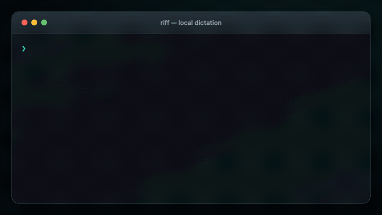

# riff

Local-first dictation CLI for macOS. Talk, capture screenshots, and riff transcribes locally with Parakeet — everything stays on your machine.


## Quickstart

Install and provision riff:

```bash
brew install calebcauthon/riff/riff
riff setup
riff doctor
```

`riff setup` is a one-time step that installs the transcription packages and downloads the Parakeet model. macOS may ask for microphone, screen-recording, or Accessibility access when you first use the related features.

Riff is designed to disappear behind global hotkeys. With Raycast, Alfred, skhd, Hammerspoon, Keyboard Maestro, or a similar launcher, bind keys of your choice to these commands:

```bash
riff --quiet toggle    # start or stop listening
riff --quiet shot      # capture a screenshot while talking
riff --quiet toggle && riff --quiet send-images  # stop and paste everything
```

For example, the overview above uses `⌥ R` for start/stop, `⌥ S` for screenshots, and `⌥ ↩` to stop and insert the transcript plus screenshots into Claude Code. Choose any keys you like. See [Hotkeys](#hotkeys) for complete examples.

Your transcript and local HTML report land under `/tmp/riff/sessions/<session-id>/`. Print the whole latest session (transcript + clipboard + base64 images) to stdout with `riff copy`, paste the transcript into the focused app with `riff send`, or open the report with `riff html`.

For the underlying command-by-command flow:



## Output hooks

Output hooks post-process the transcript with your own scripts after each
transcription — strip filler words, fix capitalization, pipe it through a local
model, whatever you like. Each hook is a bash command that receives two
temp-file paths:

- `$1` — the current transcript. **Edit it in place**; riff reads it back and
  feeds the result into the next hook.
- `$2` — a read-only JSON blob of session metadata (session id, timing,
  transcription info, screenshots, clipboard).

Configure a chain in the JSON config (`~/.riff.json`) — the `riff.hooks` array
runs in order:

```json
{
  "riff": {
    "hooks": [
      "$HOME/Code/riff/scripts/hooks/remove_ums.sh \"$@\"",
      "$HOME/Code/riff/scripts/hooks/capitalize_sentences.sh \"$@\""
    ]
  }
}
```

Use `"$@"` so the two temp paths are forwarded to your script as `$1`/`$2`.
Prefer a single hook? Set `RIFF_HOOKS` (newline-delimited) in `~/.riffrc`:

```bash
export RIFF_HOOKS='$HOME/Code/riff/scripts/hooks/remove_ums.sh "$@"'
```

Hooks run automatically on every `riff stop`/`riff toggle`. Skip them for one
run with `--no-hooks`, or add an ad-hoc hook with `--with-post-hook <cmd>`
(repeatable, runs after the configured chain). Run `riff hooks` to print the
active chain.

`scripts/hooks/remove_ums.sh` ships with riff — it drops standalone `um` filler
(`"Um, so I um think."` → `"so I think."`) while leaving words like `umbrella`
alone. Enable it by adding it to `riff.hooks` above.

**Writing your own:** any executable that rewrites `$1` in place (and may read
metadata from `$2`) works. A starter template:

```bash
#!/usr/bin/env bash
set -euo pipefail

transcript="${1:?transcript path required}"
metadata="${2:?metadata path required}"

# Rewrite the transcript in place. Here we just uppercase it.
tr '[:lower:]' '[:upper:]' < "$transcript" > "$transcript.tmp"
mv "$transcript.tmp" "$transcript"
```

Make it executable and point a `riff.hooks` entry at it with `"$@"`.

---

## Watching events

Every riff command appends to a global event bus at `/tmp/riff/events.jsonl`.
`riff watch` follows it, so you can see what riff is picking up as it happens —
sessions starting, screenshots landing, clipboard captures, transcription
finishing, hooks running, and every command's start and exit.

```bash
riff watch                    # follow from now on
riff watch --since 10m        # backfill the last ten minutes, then follow
riff watch --once --all       # print everything retained and exit
```

```text
18:03:11.482  shot   screenshot_taken     20260728-180302  shot_id=1 audio_sec=2.41
18:03:14.001  stop   session_stopping     20260728-180302
18:03:16.900  stop   transcription_finished 20260728-180302  method=parakeet_server words=87
```

Narrow it down with `--type`, `--command`, `--session <id|current>`, and
`--grep`. Add `--json` for NDJSON you can pipe into `jq`. `watch` is a viewer
only — it never runs anything in response to an event.

Set `RIFF_EVENT_BUS=0` to turn bus writes off. The full event catalog and
envelope schema live in [docs/EVENTS.md](docs/EVENTS.md).

---

## Files

```text
/tmp/riff/sessions/<session-id>/
  audio.wav
  events.jsonl
  ffmpeg.log
  transcript.txt        (if transcription succeeded)
  note.md
  note.html
  screenshots/
    shot-001.png
    ...
```

Performance/observability logs:

```text
/tmp/riff/events.jsonl              # global event bus (every command); see `riff watch`
/tmp/riff/events.jsonl.1            # previous bus generation after rotation
/tmp/riff/perf.jsonl                # start/stop and Parakeet cold-start timings
/tmp/riff/parakeet-server.log       # warm Parakeet server logs
/tmp/riff/parakeet-server.sock      # Riff-owned local inference socket
/tmp/riff/web-server.log            # local HTML web server logs
/tmp/riff/toggle-hotkey.log         # hotkey toggle/stop/send lifecycle
```

---

## Requirements

- macOS
- Rust/Cargo for source builds
- `ffmpeg` (+ optional `ffprobe`) in PATH
- Python 3.12 plus a private Parakeet runtime from `riff setup`

Install ffmpeg:

```bash
brew install ffmpeg
```

---

## Bundled Python runtime (recommended for distribution)

Use this when you want to package `riff` for another machine without relying on that machine's system Python.

Create the bundled runtime (full Python distribution copy, not a venv):

```bash
brew install uv
uv python install 3.12
./scripts/build_bundled_python_runtime.sh
```

Build the Rust binary:

```bash
cargo build --release
```

Create a full distribution artifact tarball (runtime + binary + scripts):

```bash
./scripts/create_distribution_artifact.sh
```

This writes `dist/riff-<platform>-<sha>-<timestamp>.tar.gz` plus a `.sha256` file.

Package these paths together:

```text
riff
target/release/riff
scripts/
runtime/python/
```

When run from that packaged root, `riff` will auto-use `runtime/python/bin/python` first.
This runtime is no-system-dependency for Python itself, but it is still platform/architecture-specific
(build on same OS/CPU family you intend to run).

Optional script flags:

```bash
# force a specific uv-managed source interpreter
./scripts/build_bundled_python_runtime.sh --source-python "$HOME/.local/bin/python3.12"

# copy runtime only (skip package install)
./scripts/build_bundled_python_runtime.sh --skip-install

# allow non-relocatable runtime sources (not recommended for distribution)
./scripts/build_bundled_python_runtime.sh --allow-nonrelocatable --source-python /opt/homebrew/bin/python3.12
```

---

## Commands

### Start

```bash
riff start
```

Flags:
- `--screenshot-dir <path>` override screenshot source dir
- `--audio-device <selector>` ffmpeg avfoundation selector (default `auto`, prefers built-in Mac mic and avoids iPhone/Continuity)
- `--engine <name>` transcription engine: `parakeet` (default) or `elevenlabs`

You can also set a fixed selector:

```bash
export RIFF_AUDIO_DEVICE=":1"
```

#### Transcription engines

The engine decides what happens during the session and what `riff stop` has to
wait for. It is recorded in the session state at start, so `stop`, `chunk`, and
`pause` all use the right one without you passing the flag again.

**`parakeet`** (default) — fully local, works offline. A watcher transcribes
completed segments while you talk, but the tail past the cursor is only
transcribed at stop, so `stop` costs inference time that grows with how much
audio is left unflushed.

**`elevenlabs`** — streams to Scribe v2 Realtime over a WebSocket while you
record, so the transcript is essentially finished when you stop. `stop` only
waits for a final commit (~150ms) instead of running inference over the tail.
Requires network and an API key; audio leaves your machine.

```bash
export RIFF_ELEVENLABS_API_KEY="sk_..."
riff start --engine elevenlabs

# or make it the default for every session
export RIFF_ENGINE=elevenlabs
```

Install the streaming dependency once:

```bash
pip install -r scripts/elevenlabs-requirements.txt
```

If the stream fails (dropped socket, exhausted quota, missing key), `stop`
reports `status: "error"` with whatever text was committed before the failure.
It deliberately does **not** fall back to a local transcribe — a silent fallback
would hand you a slow session while you believed you were on the fast path.
Missing credentials are caught at `start`, before anything is recorded.

Optional tuning:

| Variable | Purpose |
| --- | --- |
| `RIFF_ELEVENLABS_API_KEY` / `ELEVENLABS_API_KEY` | credentials (required) |
| `RIFF_ELEVENLABS_MODEL` | model id (default `scribe_v2_realtime`) |
| `RIFF_ELEVENLABS_LANGUAGE` | force a language instead of auto-detect |
| `RIFF_ELEVENLABS_FINALIZE_TIMEOUT_SEC` | how long `stop` waits for the final commit (default `8`) |
| `RIFF_ELEVENLABS_WS_URL` | override the endpoint (e.g. an EU/US residency host) |

#### Auto-stop safety net

Every session gets a watchdog that runs a normal `riff stop` once the session
has been recording for `RIFF_MAX_SESSION_SEC` seconds (default `300`, or 5
minutes), so a
session you forgot to stop still gets transcribed instead of recording forever.
The auto-stop takes the regular stop path, so output hooks run exactly as if you
had stopped it yourself, and a `max_duration_reached` event is written to the
session's `events.jsonl`.

Change or disable it in `~/.riffrc` (or `~/.riff.json`, or the environment):

```bash
export RIFF_MAX_SESSION_SEC=600   # cap sessions at 10 minutes
export RIFF_MAX_SESSION_SEC=0     # disable the auto-stop entirely
```

Values are clamped to 5s-24h. `riff status` shows the cap and the time left:

```
max_session_sec: 300 (auto_stop_in=273.204s)
```

### Shot (capture directly into active session)

```bash
riff shot
```

Uses macOS `screencapture -i` and writes directly to the active session's `screenshots/` folder.
This avoids delayed Desktop screenshot writes and floating thumbnail timing issues.

### Stop

```bash
riff stop
```

Stops recording and processes the session (transcription, note/html generation, screenshots, etc.).
It does **not** send output to the focused app.

Flags:
- `--no-stop-hooks` ignore stop-time hook commands and use the built-in stop pipeline
- `--no-hooks` skip just the RIFF_HOOKS output-hook chain for this run
- `--with-post-hook <cmd>` add an ad-hoc output hook for this run (repeatable; runs after RIFF_HOOKS)
- `--python-bin <path>` override python interpreter
- `--parakeet-script <path>` override script path
- `--parakeet-model <name>` override model name
- `--transcribe-cmd '<template>'` custom transcription command (advanced)
- `--post-transcribe-cmd '<template>'` rewrite transcript after transcription (advanced)

`--transcribe-cmd` placeholders:
- `{audio}`
- `{out_base}`
- `{out_txt}`
- `{session_dir}`

`--post-transcribe-cmd` placeholders:
- `{transcript}`
- `{audio}`
- `{out_base}`
- `{out_txt}`
- `{session_dir}`

`--post-transcribe-cmd` runs after riff has produced the transcript text and before `note.md` / `note.html` are rendered. If your command prints to stdout, that stdout becomes the rewritten transcript. If it writes `{out_txt}` directly, riff reads that file after the command exits.

### Toggle (start if idle, stop if active)

```bash
riff toggle
```

Useful when you want one command instead of separate `start`/`stop`.

Flags:
- Start-path flags (used when idle): `--screenshot-dir`, `--audio-device`
- Stop-path flags (used when active): `--no-stop-hooks`, `--no-hooks`, `--python-bin`, `--parakeet-script`, `--parakeet-model`, `--transcribe-cmd`, `--post-transcribe-cmd`

### Sounds (interactive picker)

```bash
riff sounds
```

Browse system/user sounds, preview each, and set start/stop beep choices.

Picker controls:
- `↑/↓` (or `j/k`) move selection
- `p` or `space` preview selected sound (uses configured repeat count for selected START/STOP sound)
- `1` set START sound (press `1` again on same sound to cycle repeats `x1 -> x2 -> x3`)
- `2` set STOP sound (press `2` again on same sound to cycle repeats `x1 -> x2 -> x3`)
- `+` / `-` increase/decrease delay between repeated beeps
- `Esc` (or `s`) save + exit
- `q` quit without saving

### Silence / Loud (global beep toggle)

```bash
riff silence   # writes RIFF_BEEP=0 to ~/.riffrc (or RIFF_RC_FILE)
riff loud      # writes RIFF_BEEP=1 to ~/.riffrc (or RIFF_RC_FILE)
```

### Status

```bash
riff status
```

### Hooks (show configured output/transcription commands)

```bash
riff hooks          # human-readable
riff hooks --json   # machine-readable
```

### Perf (startup/shutdown timing summary)

```bash
riff perf        # recent 40 records
riff perf 100    # recent 100 records
```

Summarizes `start`/`stop` timings from `/tmp/riff/perf.jsonl` (count, avg, p50, p95), reports Parakeet cold-start readiness separately, and shows recent command entries with dominant phase. `riff perf --json` exposes that distribution at `summary.parakeet_server_startup`.

`riff start` now also prints a short `startup_phase_ms` line, and `riff stop` prints `stop_phase_ms`, so you can spot the blocking phase immediately from the command output. The perf log now includes finer-grained phase timings for state setup, watcher startup/shutdown, screenshot movement, transcript generation, note rendering, and final writes.

### List recent sessions

```bash
riff list 10
```

Shows a terminal table with:
- readable timestamp (`mon 4-10 4:32pm` style)
- transcript summary (`first 3 words..last 3 words [n words]`)
- image count
- dictation length

### Copy full session to stdout

```bash
riff copy        # most recent (same as copy 1)
riff copy 3      # 3rd most recent
riff copy --verbose   # full session dump (frontmatter + transcript + raw session files)
```

`copy` prints the whole session bundle to stdout so it can be piped or redirected:

1. the transcript (which already carries `Screenshot N: <path>` lines and clipboard reference lines)
2. a `----- Clipboard captures -----` section with each captured clipboard entry as full, unescaped text
3. each screenshot inlined as base64 under a `----- Screenshot N — <file> (<mime>, base64) -----` header

Nothing is pasted anywhere — use `riff send` / `riff send-images` to paste into the focused app.

```bash
riff copy | pbcopy
riff copy > session.txt
```

`copy --verbose` switches to a full stdout export for that session:
- YAML frontmatter (session id, timing/counters, file inventory, screenshot paths)
- transcript body
- raw `note.md`, `transcript.txt`, `events.jsonl`, and `ffmpeg.log` blocks

### Send transcript to focused app

```bash
riff send        # most recent (same as send 1)
riff send 2      # 2nd most recent
```

Copies the transcript to clipboard and immediately pastes it into the currently focused app.
Screenshots are pasted as their file paths (text).

### Send transcript with inline images

```bash
riff send-images        # most recent (same as send-images 1)
riff send-images 2      # 2nd most recent
```

Same as `send`, but for each screenshot reference it copies the actual image data
to the clipboard and pastes the picture itself — useful for apps (chat boxes, docs,
editors) that accept pasted images rather than file paths. Local screenshots are
pasted as images; remote (`http`) URLs and missing files fall back to pasting the
path text. Non-PNG/JPEG/TIFF/GIF formats are converted to PNG via `sips` first.

### Show full session markdown to stdout

```bash
riff show 20260413-013011
```

`show` now takes a session id (not a numeric index). Use `riff list` to find ids.
Outputs raw `note.md` markdown for that session.

### Open session HTML report

```bash
riff html        # most recent (same as html 1)
riff html 2      # 2nd most recent
```

Behavior:
- regenerates HTML file
- ensures local web server is running
- resets web server idle timer (`/touch`)
- prints HTML filesystem path to stdout
- prints `Opening <target>`
- opens served URL (falls back to file path if server unavailable)
- HTML page includes:
  - `Copy markdown` button
  - `Copy transcript` button
  - `Copy image` button on each screenshot card (falls back to copying image path if image clipboard API is unavailable)
  - `Browse all sessions` link to `/sessions/index.html` (one transcript row per session with screenshot thumbnails)

---

## Global flags

- `--verbose` prints extra diagnostic lines (`[verbose] ...`) for troubleshooting.
  - For `riff stop`, this includes hook resolution/execution details for transcription and post-transcription commands, plus timing summaries.
  - For `riff copy`, `--verbose` instead prints a full frontmatter session dump to stdout.
- `--quiet` suppresses normal human-readable command output (good for hotkeys/automation).
  - If you also pass `--json`, JSON output still prints.
- `--json` prints structured JSON payloads for command results.
- `--dry-run` shows what would happen without making changes.
- `--no-beeps` disables start/stop beeps for this command invocation only.
  - This supersedes global sound settings (`RIFF_BEEP`, `riff silence`, `riff loud`).

Examples:

```bash
riff --dry-run start
riff --dry-run stop
riff --json status
```

---

## Latency instrumentation

Every start/stop writes structured timings to the perf log. A newly spawned Parakeet server also appends one correlated `parakeet_server_startup` record when it binds or fails:

```bash
cat /tmp/riff/perf.jsonl
```

Tail live while testing hotkeys:

```bash
tail -f /tmp/riff/perf.jsonl
```

Focus on these fields:
- start: `phases.spawn_recorder_ms`
- start: `parakeet_server_warmup.outcome` and `instance_id` (`already_healthy`, `spawned`, `still_starting`, `disabled`, or `spawn_failed`)
- Parakeet startup: `status`, `total_ms`, and `phases` (Python bootstrap, dependency imports, model load/placement, and server bind)
- stop: `phases.transcribe_ms` (usually the biggest)
- stop: `phases.web_server_ms` (local HTML server startup/health)
- stop: `phases.generate_index_ms` (sessions index rebuild cost)
- stop: `phases.write_note_html_ms` (note/html file write cost)
- stop: `transcription_perf.execution_path` (`parakeet`, `custom_command`, etc.)
- stop: `transcription_perf.server_ensure_ms` (time spent waiting for Parakeet server readiness)
- stop: `transcription_perf.python_transcribe_ms` (one-shot fallback cost when server isn’t used)
- stop: `transcription_perf.server_health_before` / `server_health_after` (server availability before/after ensure)

If `transcription_perf.server_pid_alive` is `false`, inspect:

```bash
tail -n 120 /tmp/riff/parakeet-server.log
```

Index generation tuning:

```bash
export RIFF_SESSIONS_INDEX_LIMIT=500   # default 500, range 1..5000
```

---

## Audio cues (start/stop beeps)

By default, successful start/stop plays two different macOS sounds:
- start: `Ping`
- stop: `Glass`

Customize or disable:

```bash
export RIFF_BEEP=1                 # default on (set 0 to disable)
export RIFF_BEEP_START="Ping"     # name in /System/Library/Sounds or absolute path
export RIFF_BEEP_STOP="Glass"     # name in /System/Library/Sounds or absolute path
export RIFF_BEEP_START_COUNT=1     # 1..3 repeats
export RIFF_BEEP_STOP_COUNT=1      # 1..3 repeats
export RIFF_BEEP_GAP_SEC=0.08      # launch interval between repeats (0.00..1.00); lower values overlap beeps
```

Interactive picker (preview + choose start/stop sounds):

```bash
riff sounds
```

---

## Hotkeys

Riff does not require a hotkey daemon, but it works well with skhd, Raycast, Alfred, Hammerspoon, Keyboard Maestro, or any launcher that can run shell commands.

Example skhd setup using the Homebrew-installed `riff` binary:

```text
# toggle: start if idle, stop if active
alt - 0x2C : /opt/homebrew/bin/riff --quiet toggle >> /tmp/riff/toggle-hotkey.log 2>&1

# toggle + send: if active, stop and paste transcript into the focused app
alt - 0x27 : /opt/homebrew/bin/riff --quiet toggle && /opt/homebrew/bin/riff --quiet send >> /tmp/riff/toggle-hotkey.log 2>&1

# toggle + open html: if active, stop and open the latest session report
alt - 0x29 : /opt/homebrew/bin/riff --quiet toggle && /opt/homebrew/bin/riff --quiet html >> /tmp/riff/toggle-hotkey.log 2>&1
```

On Intel Homebrew, replace `/opt/homebrew/bin/riff` with `/usr/local/bin/riff`. For a local checkout, use `target/release/riff` after running `cargo build --release`.

---

## Troubleshooting Parakeet import errors

If you see dependency/import errors even after pip install, check your Python version:

```bash
$RIFF_PYTHON_BIN -V
```

If it's `3.13+` (especially 3.14), recreate your environment with Python 3.12.

For dev venv:

```bash
rm -rf .venv
python3.12 -m venv .venv
source .venv/bin/activate
pip install --upgrade pip
pip install -r scripts/parakeet-requirements.txt
```

For bundled runtime:

```bash
uv python install 3.12
./scripts/build_bundled_python_runtime.sh --python-version 3.12
```

Check bundled runtime directly:

```bash
./runtime/python/bin/python -V
```
